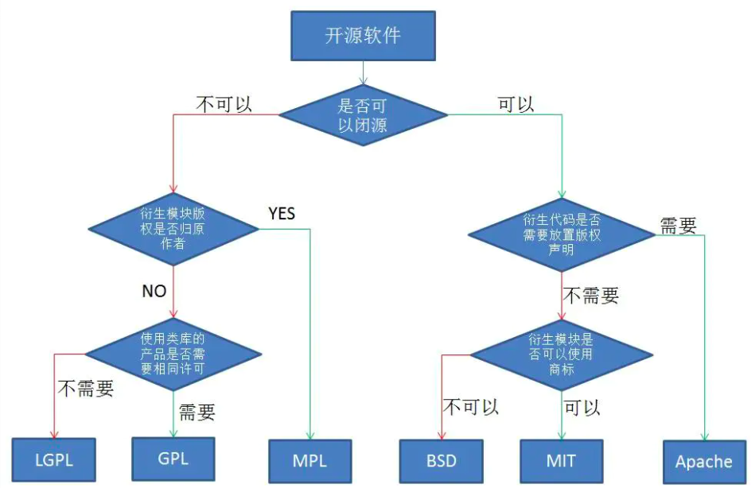

# License

## MIT

### 被授权人权利

被授权人有权利使用、复制、修改、合并、出版发行、散布、再授权及贩售软件及软件的副本。

被授权人可根据程序的需要修改授权条款为适当的内容。

### 被授权人义务

在软件和软件的所有副本中都必须包含版权声明和许可声明。

### 其他重要特性

此授权条款并非属[copyleft](https://baike.baidu.com/item/copyleft)的自由软件授权条款，允许在自由/开放源码软件或非自由软件（proprietary software）所使用。

MIT的内容可依照程序著作权者的需求更改内容。此亦为MIT与[BSD](https://baike.baidu.com/item/BSD)（The BSD license, 3-clause BSD license）本质上不同处。

MIT条款可与其他授权条款并存。另外，MIT条款也是自由软件基金会（FSF）所认可的自由软件授权条款，与[GPL](https://baike.baidu.com/item/GPL)兼容。

![MIT license](/Users/miyakaka/Coding/gitbook/Picture/MIT license.jpeg

## BSD（二条款版）

分发软件时，必须保留原始的许可证声明。

## BSD（三条款版）

分发软件时，必须保留原始的许可证声明。不得使用原始作者的名字为软件促销。

## MIT

分发软件时，必须保留原始的许可证声明，与 BSD（二条款版）基本一致。

## Apache 2

分发软件时，必须保留原始的许可证声明。凡是修改过的文件，必须向用户说明该文件修改过；没有修改过的文件，必须保持许可证不变。

## GPL

如果项目包含了 GPL 许可证的代码，那么整个项目都必须使用 GPL 许可证。

## LGPL

如果项目采用动态链接调用该许可证的库，项目可以不用开源。

## MPL

只要该许可证的代码在单独的文件中，新增的其他文件可以不用开源。

