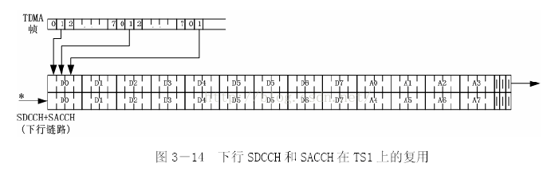
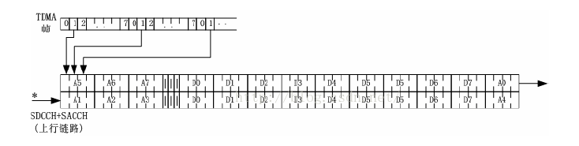

# 2G

[TOC]

## GSM网络结构

### BTS 基站收发
基站，与MS无线传输，无线分集，信道加密以及调频。
BTS分小区（一般3个），每个小区频点不同。 相隔一定距离的BTS可以复用频率。
### BSC 基站控制器
无线网络资源管理，小区配置，功率控制，定位和切换
与BTS是Abis口连接，与MSC是A口连接
### MSC 移动业务交换中心
连接移动用户与移动用户，移动用户与固定用户
位置登记、越区切换
### VLR 访问用户位置寄存器
### HLR 归属用户位置寄存器
GSM中央数据库，存放用户权限业务位置等所有信息
### AUC 鉴权中心
### EIR 移动设备识别寄存器
IMEI/IMSI
MSISDN: 手机号
全球小区识别码：CGI = LAI + CI
LAI: 位置识别区，对应MSC?
CI: 运营部门自定义，对应BSC?

## 无线接口
### 频率

全双工，收发间隔45MHz~95MHz

### 频分复用+时分复用

信道(频点)间隔200kHz, 每个频点分为8个时隙，既8个信道

每个时隙0.577ms，

GSM多址方式TDMA和FDMA相结合的调频方式，每个载波有8个物理信道。

每个物理信道可以由TDMA帧号，时隙号，调频序列号来定义

小区频率复用：

### 终端发送功率

GSM发送功率？

## GSM逻辑信道

### 业务信道（TCH）

1. 话音业务信道
   * TCH/FS: 全速率语音信道 13kbit/s
   * TCH/HS: 半速率语音信道 5.6kbit/s

2. 数据业务信道
   * TCH/F9.6 kbit/s 全速率数据信道
   * TCH/F4.8 kbit/s 全速率数据信道
   * TCH/H4.8 kbit/s 半速率数据信道
   * TCH/F2.4 kbit/s 全速率数据信道
   * TCH/H2.4 kbit/s 半速率数据信道

### 控制信道

1. 广播信道(BCH) - 目标是小区内所有手机，单向下行信道，一般占据TS0下发
   * 频率矫正信道（FCCH）,校正MS频率，使其能解调出当前小区信号
   * 同步信道（SCH）,FCCH解码后，SCH同步MS需要知道的信息，如TDMA帧号、基站识别码BSIC
   * 广播控制信道(BCCH)，MS通过BCCH信道获取当前小区/相临小区的频点、LAI、控制等信息。
2. 公共控制信道(CCCH) - 目标是小区所有MS
   * 寻呼信道（PCH）,下行，网络对MS进行寻呼，根据MS登记的LAC号，对所有具有该LAI号的小区进行寻呼
   * 接入许可信道（AGCH), 下行，网络接收到空闲MS接入信道请求后分配一个专用信道SDCCH，通过AGCH广播该信道的接入参数
   * 小区广播控制信道（CBCH）,下行，广播天气交通等的短消息
   * 随机接入信道（RACH）,上行，MS想要建立连接时，通过RACH广播它需要的服务信道SDCCH，包括3个比特原因（电话、短消息、数据、位置更新等），5个bit随机数用于区分不同MS

###  专用控制信道

* 独立专用控制信道（SDCCH）:双向专用信道，用在分配TCH之前的呼叫建立过程中传送系统信令。传输建立连接的信令、位置更新消息、短消息、用户鉴权消息、加密命令以及应答。
* 慢速随路控制信道（SACCH）:伴随着TCH和SDCCH的专用信令信道。上行链路传输无线测量报告、TA值（最大时间提前）、功率控制级别。下行链路主要传递通信质量、LAI、CI、领小区信号强度、TA、功率控制级别等
* 快速随路控制信道（FACCH）:在话音传输过程中突然需要快速传递信令，会使用FACCH。FACCH会借用20ms话音突发脉冲序列传递信令。

**短信下行： TCH分配以前，在SDCCH上传输，TCH分配以后，在SACCH上传输。**

### 信道使用场景图

## GSM逻辑信道和物理信道映射关系

### 帧和复帧

1. 每一帧TDMA帧有8个time slot， 8*0.577ms = 4.615ms
2. TDMA帧号3.5h（2715648个TDMA帧）为周期循环，每2715648个TDMA帧为一个超高帧
3. 每个超高帧分为2048个超帧，一个超帧为6.12s
4. 超帧由复帧组成，由两种复帧
   * **26帧的复帧** - 26个TDMA帧，120ms。每个超帧由51个26复帧组成，**用于TCH（和SACCH 和 FACCH）**
   * **51帧的复帧** - 51个TDMA帧，约235ms。每个超帧由26个51复帧组成，**用于BCH和CCCH**

### 突发脉冲序列

TDMA信道上一个时隙中的信息格式称为突发脉冲序列。共有五种类型

* 普通突发脉冲序列（NB）：用于携带TCH以及除RACHA，SCH和FCCH以外的控制信道上的信息
* 频率校正突发脉冲序列（FB）：用于移动台的频率同步，它相当于一个带频移的未调载波。此突发脉冲序列的重复称为FCCH。
* 同步突发脉冲序列（SB）：用于移动台的时间同步，它包括一个易被检测的长同步序列并携带有TDMA帧号和基站识别码（BSIC）信息。这种突发脉冲序列的重复称为SCH。
* 接入突发脉冲序列（AB）：用于随机接入，它有一个较长的保护间隔，是为适应移动台首次接入（或切换到另一个BTS）后不知道时间提前量而设置的。移动台可能远离BTS，这意味着初始突发脉冲序列会迟到一些到达BTS，由于第一个突发脉冲序列中没有时间调整，为了不使第一个突发脉冲序列与下一时隙中的突发脉冲序列重叠，此突发脉冲会短一些。
* 空闲突发脉冲（DB）：此突发脉冲序列在某些情况下由BTS发出，不携带任何信息。

### 逻辑信道和物理信道映射

1. 控制信道

   * **下行链路-TS0 - 控制信道 (BCH/CCCH)- 51帧 - 周期235ms**

   TS0时隙用于映射控制信道。51复帧用于携带控制信道，控制信道都在TS0时隙上

   

   

   F即FCCH、S即SCH、B即BCCH、C即CCCH、I即IDLE。即使没有寻呼或接入进行，BTS也会再C0上发射，用空闲突发脉冲序列代替。

   

   * **下行链路 - TS1 - 专用控制信道（SDCCH/SACCH) - 51帧*2 - 周期 470ms**

   TS1时隙用于映射专用控制信道。它是102个TDMA帧（51帧*2）复用一次，三个空闲帧之后再从D0开始

   

   其中，Dx（SDCCH）—— 此处移动台x是一个正在建立呼叫或更新位置或与GSM交换系统参数的移动台。Dx只在移动台x建立呼叫时使用，在移动台x转到TCH上开始通话或登记完释放后，Dx可用于其它MS。

   Ax（SACCH）—— 在传输建立阶段（也可能是切换时）必须交换控制信令，如功率调整等信息，移动台x的此类信令就是在该信道上传送。**未分配TCH前短信在此信道传输**

   

   * **上行链路 - TS0 - RACH - 51帧 - 周期235ms**

     上行链路载频C0上映射的TS0是不包含上述各信道的，它只含有随机接入信道RACH，用于移动台的接入

   

   

   * **上行链路 - TS1 - 专用控制信道（SDCCH/SACCH) - 51帧*2 - 周期 470ms**

     

   2. 业务信道映射

      * **下行链路 - TS2 - TCH/SACCH - 26帧 - 周期120ms**

        

        其中，T（TCH）—— 编码语音或数据，用于通话。 FACCH可能会借用20ms。

        A（SACCH）—— 控制信号。用于移动台接收命令改变输出功率、了解应监视哪些BTS的BCCH、向系统报告从周围BTS接收到的信号强度等。**短信此时下行**

        I（IDLE）—— 空闲帧。它不包含任何信息，主要用于配合测量。

      * **上行链路同下行**

   3. 多频点

      在C0载频上的全部TS为：

      * TS0：逻辑控制信道，重复周期为51个TS

      * TS1：逻辑控制信道，重复周期为102个TS

      * TS2~TS7：逻辑业务信道，重复周期为26个TS

      其它所有载波（CS1~CS7）的TS0~TS7时隙全部都是业务信道TCH。

## 功率控制

距离基站近的MS要减小发射功率，减低对其他用户的干扰。距离远的MS要提高发射功率，克服路径衰耗

GSM手机以2dB为一个等级进行功率调整。GSM900最大发射功率8W, DCS1800最大发射功率1W，相应的其小区覆盖范围小。

## GSM寻呼/接入流程

## GPRS/UMTS网络架构

### PCU （package control unit）

与BSC部署在一起，将分组数据从GSM语音数据里分离出来，并传递到SGSN

### SGSN(GPRS服务支持节点)

MSC分组版，对移动台进行鉴权、移动性管理、路由选择，建立到GGSN的通道并把数据传递给它（GTP协议)

### GGSN(GPRS网关支持节点)

GSGN作为整个GPRS/UMTS网络的网关，位于GPRS网络和外部分组交换网络（Internet）之间。网关的作用能将一种协议格式的数据转换为另一种格式的数据。GGSN把来自的SGSN的GPRS数据包转化为适当的分组数据协议格式,比如IP，然后再把它们发送到相应的分组数据网络。

### SGSN与GGSN区别

GGSN作为网关，是在不同的通信网中转换协议，而SGSN作为路由，只是在使用相同协议的网络中发送、接受以及延迟它的数据包。

GGSN能够实现地址的转换，比如把无线网络内部地址（PDP地址）转换为一个分组数据网络协议地址（IP地址），而SGSN只能实现PDP地址映射。

**我们常说的3、4G网络的IP地址，其实就是对应GGSN的出口IP地址**。

## GPRS核心网工作原理

在GPRS/UMTS分组域核心网中，**通过PDP上下文（Pocket Data Protocol, 分组数据协议）来管理用户从移动终端到GGSN及外部分组数据网的数据路由信息**。PDP上下文的数据分别存储在移动终端、SGSN和GGSN中。

**移动用户需要使用分组数据业务时，需要先执行激活PDP上下文，激活成功后，在移动终端、SGSN和GGSN中就增加了一条新的PDP上下文记录，根据这条记录信息，SGSN和GGSN才能正确地路由和转发用户数据**。

1. PDP ACTIVE

   

2. 数据传输

   

3. PDP deactive

   

## GPRS逻辑信道

| 组别  | 名称       | 对应GSM信道 | 方向       | 功能         |
| ----- | ---------- | ----------- | ---------- | ------------ |
| PBCCH | PBCCH      | BCCH        | 下行       | 广播         |
| PCCCH | PRACH      | RACH        | 上行       | 随机接入申请 |
|       | PPCH       | PCH         | 下行       | 寻呼         |
|       | PAGCH      | AGCH        | 下行       | 允许接入     |
| PTCH  | PDTCH/PDCH | TCH         | 上行和下行 | 数据传输     |
|       | PACCH      | SACCH       | 上行和下行 | 随路控制     |

## DTM dual transfer mode

手机终端分为3类：

Class A: 可以同时附着在GSM和GPRS网络上，同时接受GSM和GPRS的寻呼消息，可以同时进行GSM和GPRS业务

Class B：可以同时附着在GSM和GPRS网络上，同时接受GSM和GPRS的寻呼消息，但不能同时进行GPRS和GSM业务。数据传输的过程中可以接收到GSM的寻呼消息，这时用户可以选择暂停数据传输而接听电话，或者拒绝接听电话而继续数据传输。

Class C:只能附着在GSM或GPRS网络上。

网络端实现DTM:

BSC的2种寻呼方式

* A口寻呼：在手机没有进行PS业务的情况下，在CCCH信道上发送。

* Gb口寻呼：在手机没有进入PS传输状态的情况下，如果配置了PBCCH信道则在PCCCH信道上发送，否则在CCCH信道上发送。

3种联合寻呼（协作寻呼）的网络操作模式：

**模式1（要求CN配置Gs接口，CN侧提供联合寻呼功能）：**CS寻呼从Gb口下发，在传输状态下在PACCH信道上发送给手机，非传输状态下按照上面描述的Gb口寻呼消息在PCCCH或CCCH上发送。

Gs接口是MSN和SGSN间的接口，连接了CS和PS的交换设备。有了这条桥梁，CS paging可以方便的假道PS域传输下去，通过SGSN来实现对手机的GSM的寻呼。

**模式2（要求BSC具备相关功能，无线侧提供联合寻呼功能）：**正常状态下，CS寻呼和PS寻呼都在CCCH信道上发送。BSC支持寻呼协作时，PS传输状态下，CS寻呼可以在PACCH上发送。即，在PD信道（PACCH）上下发CS业务的寻呼消息，使得手机在做PS业务时CS业务的寻呼也能响应。

**实现原理**

模式1：MS处于IMSI和GPRS附着状态时，MSC通过SGSN来进行CS寻呼。如果MS处于standby状态，在路由区范围内寻呼该MS；如果MS处于ready态，则在小区范围内寻呼该MS。在这种操作模式下，CS寻呼在GPRS寻呼信道或业务信道上下发，MS只需要监听一条信道即可。

模式2：对于在进行PS业务的MS，对该MS的CS寻呼在分组数据信道上下发；对于正在CS业务的MS，对该MS的PS寻呼在CS专用信道上下发。

BSC开启联合寻呼功能后内部实现增加相应模块（或软功能），负责处理A接口传来的分组域消息：

1. BSC在收到从A口发送过来的CS寻呼消息后，查询该手机是否正在进行PS业务；
2. 如果手机正在进行PS业务，则将CS寻呼消息在手机的分组数据信道PACCH上发送给手机。
3. BSC通过寻呼消息中的IMSI，来查找对应MS的信息，如果查找不到相关的MS信息，则在CCCH寻呼信道上进行正常CS寻呼。
4. 此时手机暂停PS业务，响应CS寻呼。

## 参考文档

https://wenku.baidu.com/view/07859bf3a3c7aa00b52acfc789eb172dec639966.html

https://blog.csdn.net/houqd2012/article/details/49872369

https://wenku.baidu.com/view/a4df2dc0bb4cf7ec4afed0f4.html?rec_flag=default

https://wenku.baidu.com/view/3edda805970590c69ec3d5bbfd0a79563d1ed4f9.html

https://blog.csdn.net/zhuyiquan/article/details/52759930

